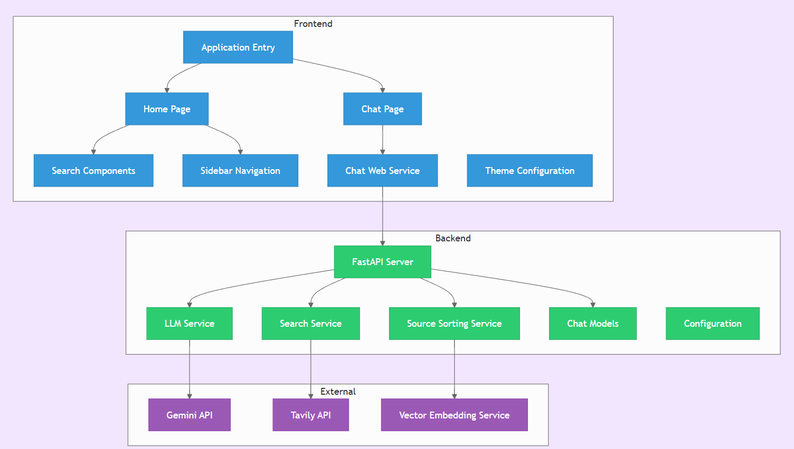
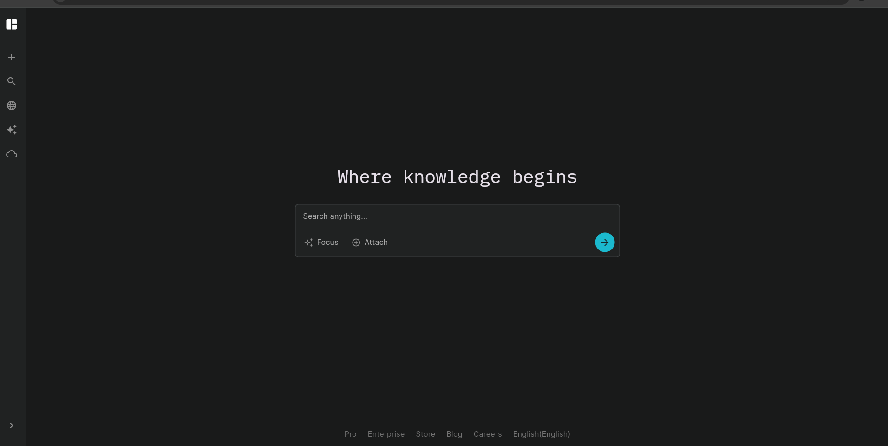
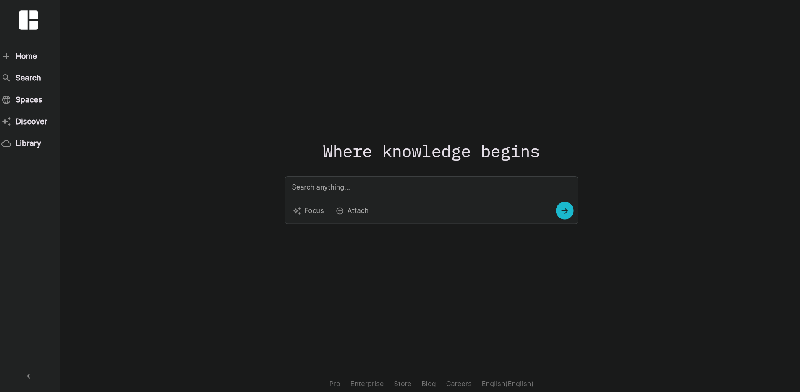
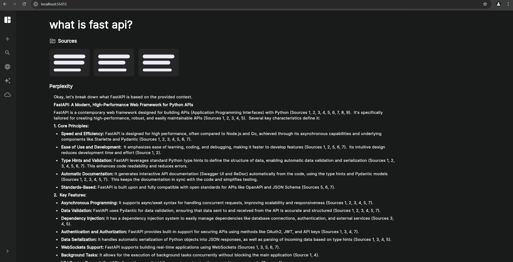

# InquireAI - Intelligent RAG-Powered Search Assistant

InquireAI is a sophisticated search assistant application that combines the power of web search, intelligent content ranking, and large language models to deliver precise, contextual answers to user queries. Built with Flutter and powered by cutting-edge APIs, it provides a Perplexity-like experience with real-time chat functionality.
## FlowChart

## Screenshot




## Features

**Intelligent Web Search**
- Leverages Tavily API for comprehensive web content retrieval
- Fetches relevant sources from across the internet in real-time

**Smart Content Ranking**
- Advanced similarity-based ranking using sentence transformers
- Vector embeddings and cosine similarity calculations
- Prioritizes most relevant sources for accurate responses

**AI-Powered Response Generation**
- Utilizes Gemini API for contextual, coherent answer generation
- Synthesizes information from multiple ranked sources
- Delivers concise, well-structured responses

**Real-Time Communication**
- WebSocket integration for instant chat functionality
- Seamless client-server communication
- Responsive user experience

---

## Architecture Overview


InquireAI follows a three-stage RAG (Retrieval-Augmented Generation) pipeline:

### Step 1: Information Retrieval
- **Web Search**: Query processing through Tavily API
- **Content Extraction**: Retrieval of relevant web sources and snippets
- **Data Preprocessing**: Clean and structure retrieved content

### Step 2: Content Ranking & Selection
- **Vector Embedding**: Convert queries and content to high-dimensional vectors
- **Similarity Calculation**: Compute cosine similarity scores
- **Source Ranking**: Order sources by relevance to user query
- **Top-K Selection**: Select highest-ranking sources for response generation

### Step 3: Response Synthesis
- **Context Assembly**: Combine top-ranked sources with user query
- **LLM Processing**: Generate response using Gemini API
- **Response Optimization**: Ensure coherence and accuracy
- **Real-time Delivery**: Stream response to user via WebSocket
---

## Technologies Used


**Frontend**
- Flutter - Cross-platform mobile development
- WebSocket Client - Real-time communication

**Backend APIs**
- Tavily API - Web search and content retrieval
- Gemini API - Large language model for response generation

**AI/ML Components**
- Sentence Transformers - Text vectorization
- Cosine Similarity - Content ranking algorithm
- Vector Embeddings - Semantic similarity computation

**Communication**
- WebSocket Protocol - Real-time bidirectional communication
---

## Installation

1. Clone this repository:
   ```bash
   git clone https://github.com/k3tikvats/perplexity_RAG.git
   ```
2. Navigate to the project directory:
   ```bash
   cd perplexity_RAG
   ```
3. Install dependencies:
   ```bash
   flutter pub get
   ```
4. Configure the APIs:
   - Obtain API keys for Tavily and Gemini.
   - Add them to the appropriate configuration file.

5. Run the application:
   ```bash
   flutter run
   ```

---

## Usage

1. Enter your query in the search bar.
2. The app will:
   - Search the web for relevant sources.
   - Rank the sources based on content similarity.
   - Generate and display a concise response.
3. View the ranked sources and the final response.

---

## How It Works

### Backend Workflow
1. **Input Query:** The user inputs a query in natural language.
2. **Web Search:** Tavily API retrieves web search results.
3. **Similarity Ranking:** The app calculates cosine similarity between the query and search results to rank sources.
4. **Response Generation:** Gemini API uses the top-ranked sources to generate a response.
5. **WebSocket**: For real-time chat functionality and communication between client and server.
---

## Example

### Query:
> "How does photosynthesis work?"

### Workflow:
1. **Search Results:** Fetch relevant links and snippets on photosynthesis.
2. **Rank Sources:** Identify the most relevant sources by calculating similarity scores.
3. **Final Response:** Generate an answer explaining photosynthesis in detail, leveraging LLM capabilities.

---

## Future Improvements

- Integrate more advanced ranking algorithms to improve source selection.
- Enable multi-modal support for images and videos.
- Optimize response generation time.

---

## Contributing

Contributions are welcome! Please fork the repository and submit a pull request.

---

## License

This project is licensed under the MIT License. See the LICENSE file for details.

---

## Acknowledgments

- [Sentence Transformers](https://www.sbert.net/)
- [Tavily API Documentation](https://tavily-docs-link)
- [Gemini API Documentation](https://gemini-docs-link)

